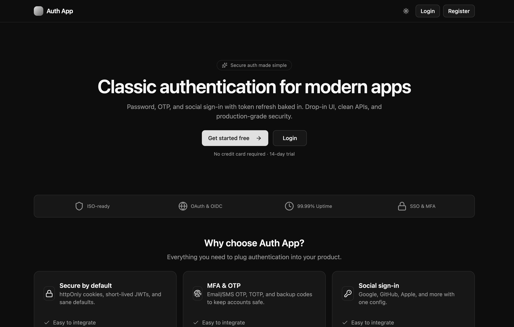
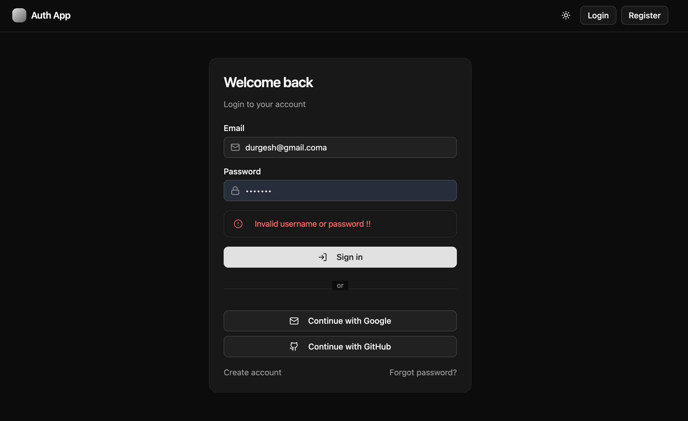
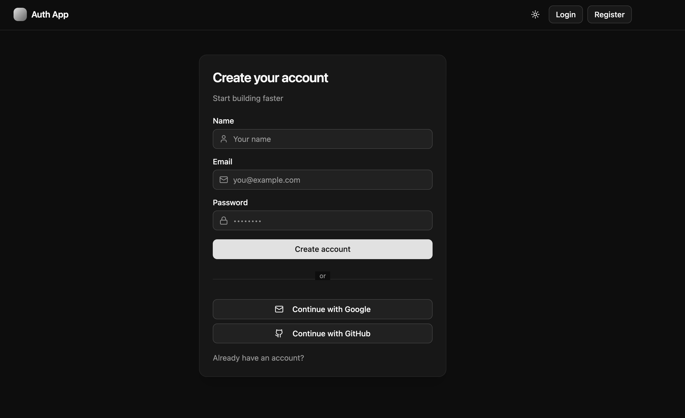
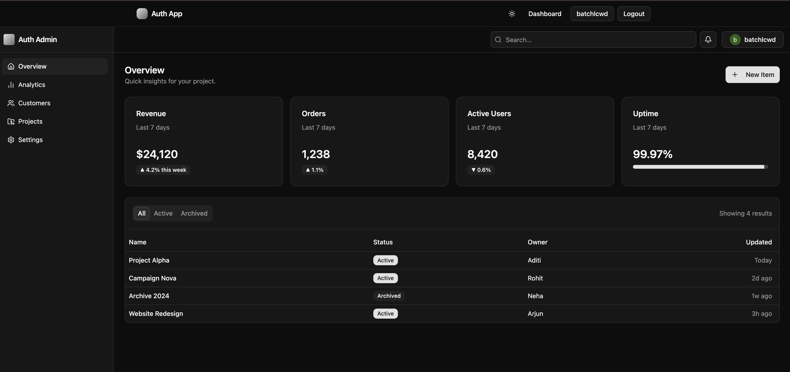

# 🔐 Full Stack Authentication App — React + Vite + Spring Boot

A complete **authentication system** built using **React (Vite)** on the frontend and **Spring Boot** on the backend.  
Supports **JWT-based authentication** with **username/password login**, as well as **Google** and **GitHub OAuth2 login**.

---

## 🧱 Tech Stack

### 🖥️ Frontend

- React (Vite)
- Tailwind CSS
- Axios
- React Router DOM
- ShadCN UI (optional)

### ⚙️ Backend

- Spring Boot 3.x
- Spring Security 6.x
- Spring Data JPA (MySQL)
- OAuth2 Client (Google, GitHub)
- JWT Authentication
- Lombok + HikariCP

---

## Screenshots

### Home page



### Login page


### Login page with error



### Register page



### Dashboard



## 📁 Project Structure

```
auth-app-boot-react/
│
├── backend/                  # Spring Boot Backend
│   ├── src/
│   ├── pom.xml
│   └── application.yml
│
├── frontend/                 # React + Vite Frontend
│   ├── src/
│   ├── package.json
│   └── vite.config.js
│
└── README.md
```

---

## ⚙️ Backend Setup (Spring Boot)

### 🧩 Prerequisites

- Java 17+
- Maven 3.9+
- MySQL (or compatible database)
- Git

### 🧰 Steps to Run Backend

1. Navigate to the backend folder:

   ```bash
   cd backend
   ```

2. Create a new database:

   ```sql
   CREATE DATABASE auth_app;
   ```

3. Configure `application.yml`:

   ```yaml
   server:
     port: 8081

   spring:
     application:
       name: auth-backend
     datasource:
       url: jdbc:mysql://localhost:3306/auth_app
       username: root
       password: root
     jpa:
       hibernate:
         ddl-auto: update
       show-sql: true
       properties:
         hibernate:
           dialect: org.hibernate.dialect.MySQL8Dialect

   security:
     jwt:
       secret: ${JWT_SECRET}
       issuer: auth-backend
       access-ttl-seconds: 900
       refresh-ttl-seconds: 1209600
       refresh-cookie-name: refresh_token
       cookie-secure: false
       cookie-same-site: Lax

     oauth2:
       client:
         registration:
           google:
             client-id: ${GOOGLE_CLIENT_ID}
             client-secret: ${GOOGLE_CLIENT_SECRET}
             redirect-uri: "{baseUrl}/login/oauth2/code/{registrationId}"
             scope: [email, profile]
           github:
             client-id: ${GITHUB_CLIENT_ID}
             client-secret: ${GITHUB_CLIENT_SECRET}
             redirect-uri: "{baseUrl}/login/oauth2/code/{registrationId}"
             scope: [user:email, read:user]
   ```

4. Set environment variables:

   ```bash
   export JWT_SECRET="your-random-long-secret"
   export GOOGLE_CLIENT_ID="your-google-client-id"
   export GOOGLE_CLIENT_SECRET="your-google-client-secret"
   export GITHUB_CLIENT_ID="your-github-client-id"
   export GITHUB_CLIENT_SECRET="your-github-client-secret"
   ```

5. Run the Spring Boot app:
   ```bash
   mvn spring-boot:run
   ```

---

## 💻 Frontend Setup (React + Vite)

### 🧩 Prerequisites

- Node.js 18+
- npm / yarn / pnpm

### ⚙️ Steps to Run Frontend

1. Navigate to frontend directory:

   ```bash
   cd frontend
   ```

2. Install dependencies:

   ```bash
   npm install
   ```

3. Create `.env` file inside `frontend/`:

   ```bash
   VITE_BACKEND_URL=http://localhost:8081
   ```

4. Start development server:
   ```bash
   npm run dev
   ```

📍 Frontend runs on **http://localhost:5173**

---

## 🔗 Authentication Flow

1. **User Login (Email/Password):**

   - User logs in via frontend.
   - Spring Boot backend verifies credentials.
   - Returns JWT tokens (access + refresh).

2. **OAuth Login (Google / GitHub):**

   - Redirects to provider login page.
   - On success, backend issues JWTs.
   - React app stores tokens securely (cookie / memory).

3. **Token Refresh:**

   - When access token expires, refresh token is used silently to generate a new one.

4. **Logout:**
   - Cookies/tokens are cleared; session invalidated.

---

## 🔑 Example API Endpoints

| Method | Endpoint                       | Description                    |
| ------ | ------------------------------ | ------------------------------ |
| `POST` | `/api/auth/login`              | Login with username & password |
| `POST` | `/api/auth/register`           | Register a new user            |
| `GET`  | `/api/auth/me`                 | Get current logged-in user     |
| `GET`  | `/oauth2/authorization/google` | Redirect to Google login       |
| `GET`  | `/oauth2/authorization/github` | Redirect to GitHub login       |
| `POST` | `/api/auth/refresh`            | Refresh access token           |
| `POST` | `/api/auth/logout`             | Logout and clear tokens        |

---

## 🧠 Environment Variables Summary

| Variable               | Description              | Example                            |
| ---------------------- | ------------------------ | ---------------------------------- |
| `JWT_SECRET`           | Secret key for JWT       | `random-long-secret`               |
| `GOOGLE_CLIENT_ID`     | Google OAuth client ID   | `xxxxx.apps.googleusercontent.com` |
| `GOOGLE_CLIENT_SECRET` | Google OAuth secret      | `xxxxxx`                           |
| `GITHUB_CLIENT_ID`     | GitHub OAuth client ID   | `ghp_xxxxx`                        |
| `GITHUB_CLIENT_SECRET` | GitHub OAuth secret      | `ghs_xxxxx`                        |
| `VITE_BACKEND_URL`     | Backend URL for frontend | `http://localhost:8081`            |

---

## 🧰 Common Commands

| Task            | Command                         |
| --------------- | ------------------------------- |
| Run backend     | `mvn spring-boot:run`           |
| Run frontend    | `npm run dev`                   |
| Build frontend  | `npm run build`                 |
| Package backend | `mvn clean package`             |
| Run backend JAR | `java -jar target/auth-app.jar` |

---

## 🧩 Deployment Tips

- Build frontend for production:
  ```bash
  npm run build
  ```
- Copy `dist/` files to `backend/src/main/resources/static` for single-server deployment.
- For separate deployment:
  - Host frontend on Netlify/Vercel.
  - Host backend on Render/AWS/DigitalOcean.
  - Update `VITE_BACKEND_URL` to production backend URL.
- Use HTTPS and set cookies with `secure` and `SameSite=Lax`.

---

